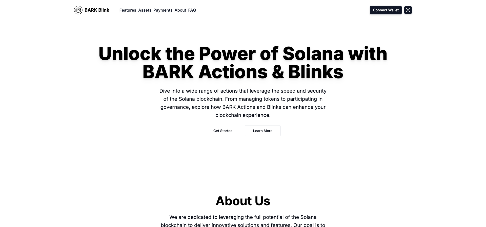
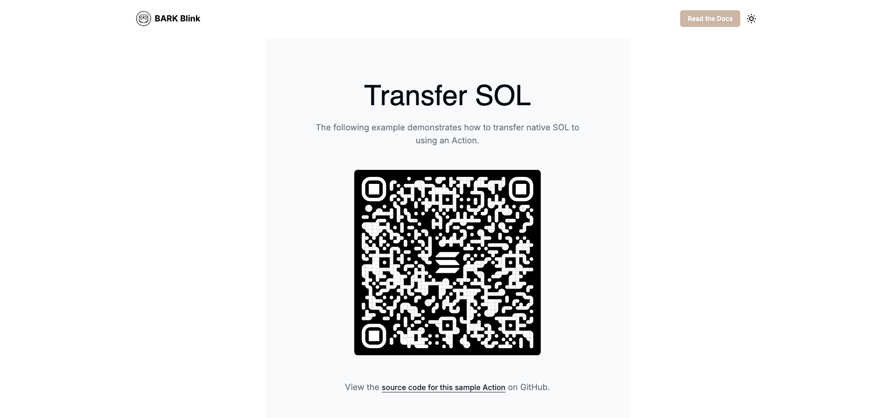

# Solana Actions and Blinks

**BARK (Blockchain Asset and Reward Keeper)** is a platform designed to simplify and enhance interactions with blockchain-based assets, particularly on the Solana network. BARK Blink is a core feature of this platform, aimed at making blockchain actions more accessible and user-friendly.

## BARK Blink Description

**BARK Blink** is a feature of the BARK platform that streamlines key interactions on the Solana blockchain. It offers a user-friendly interface for performing various tasks, such as sending messages, staking tokens, and transferring assets. The goal of BARK Blink is to enhance the efficiency and accessibility of blockchain operations for users.

## Key Features

1. **On-chain Memo**: 
   - **Description**: Send simple text messages directly to the blockchain using an SPL Memo. Useful for annotating transactions or recording messages permanently on-chain.

2. **Staking SOL**: 
   - **Description**: Stake SOL tokens to a validator to help secure the Solana network and earn rewards. 

3. **Transfer Native SOL**: 
   - **Description**: Transfer native SOL tokens between Solana wallets. Essential for moving assets within the Solana ecosystem.

4. **Transfer SPL Tokens** (Optional): 
   - **Description**: Transfer SPL tokens, which are tokens built on the Solana network. This feature is currently commented out but can be enabled for additional functionality.

5. **Mint an NFT** (Optional): 
   - **Description**: Mint NFTs (Non-Fungible Tokens) on the Solana blockchain. This feature allows users to create unique digital collectibles. It is currently commented out and can be enabled as needed.

6. **Donate**: 
   - **Description**: Make donations to support causes or projects. 

7. **Payments**: 
   - **Description**: Manage or make payments for various services.

8. **Vote**: 
   - **Description**: Participate in community or governance voting.

9. **Manage Wallet**: 
   - **Description**: View and manage wallet settings and details.

## Logical Flow

1. **Landing Page**:
   - **Overview**: Users are welcomed with an introduction to BARK and its features.
   - **Call to Action**: Options to explore functionalities like sending memos, staking SOL, or transferring assets.
  
#### Application Screenshots

**Application UI/UX**


**Transactions**


**Donate**

```

2. **Feature Selection**:
   - Users select the action they wish to perform from a list of available features.
   - Each feature includes a description and an icon for easy identification.

3. **Execution of Actions**:
   - **On-chain Memo**: Input and submit a message to be recorded on-chain.
   - **Staking SOL**: Choose a validator and specify the amount of SOL to stake. The platform processes the staking transaction.
   - **Transfer Native SOL**: Enter the recipient's wallet address and the amount of SOL to transfer.
   - **Transfer SPL Tokens**: Similar to native SOL transfers but for SPL tokens (if enabled).
   - **Mint an NFT**: Select a collection and mint a new NFT (if enabled).
   - **Donate**: Make a donation to a selected cause or project.
   - **Payments**: Manage or make payments as needed.
   - **Vote**: Participate in governance or community voting.
   - **Manage Wallet**: Access and adjust wallet settings and details.

4. **Confirmation and Feedback**:
   - Receive confirmation of transaction success or failure.
   - View transaction details and updated balances or records.

5. **Integration and User Experience**:
   - Designed for intuitive navigation and efficient task completion.
   - Provides additional resources or help options for users needing assistance.

## Installation

To get started with BARK Blink, follow these steps:

1. **Clone the Repository**

   ```bash
   git clone https://github.com/barkprotocol/solana-actions-blink.git
   ```

2. **Navigate to the Project Directory**

   ```bash
   cd solana-actions-blink
   ```

3. **Install Dependencies**

   ```bash
   npm install
   ```

   or

   ```bash
   yarn install
   ```

4. **Run the Development Server**

   ```bash
   npm run dev
   ```

   or

   ```bash
   yarn dev
   ```

   The app will be available at `http://localhost:3000`.

## Configuration

### Environment Variables

Ensure you have a `.env.local` file in the root of the project with the necessary configuration. For example:

```env
NEXT_PUBLIC_SOLANA_NETWORK=devnet
NEXT_PUBLIC_SOLANA_RPC_URL=https://api.devnet.solana.com
```

Replace the values with your actual configuration details.

## Contributing

Contributions are welcome! To contribute:

1. Fork the repository.
2. Create a new branch (`git checkout -b feature/your-feature`).
3. Commit your changes (`git commit -am 'Add new feature'`).
4. Push to the branch (`git push origin feature/your-feature`).
5. Create a new Pull Request.

## License

This project is licensed under the MIT License - see the [LICENSE](LICENSE) file for details.

## Acknowledgments

- **Solana**: [Solana](https://solana.com) for the blockchain infrastructure.
- **Next.js**: [Next.js](https://nextjs.org) for the React framework.
- **Lucide Icons**: [Lucide Icons](https://lucide.dev) for the icon library.
